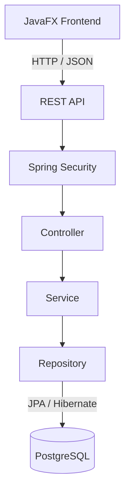
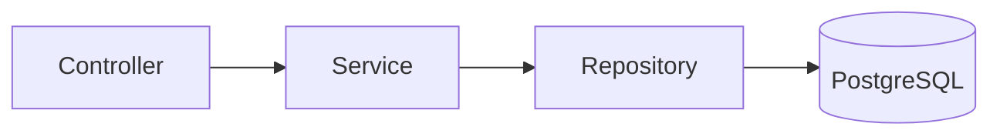
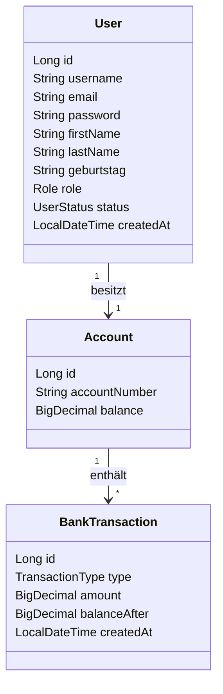
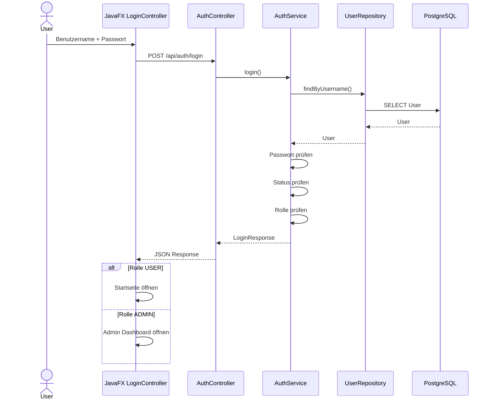
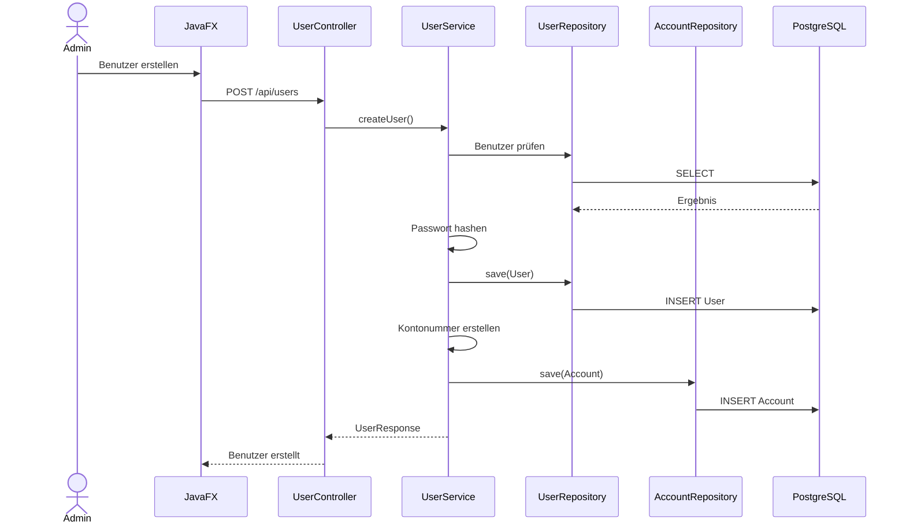
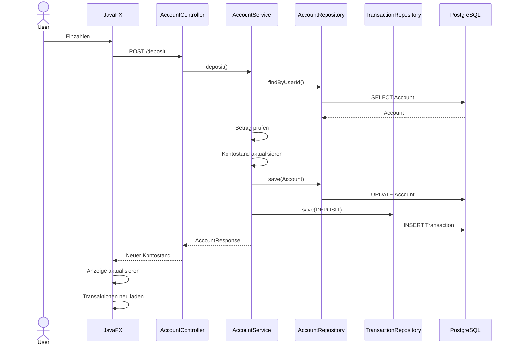
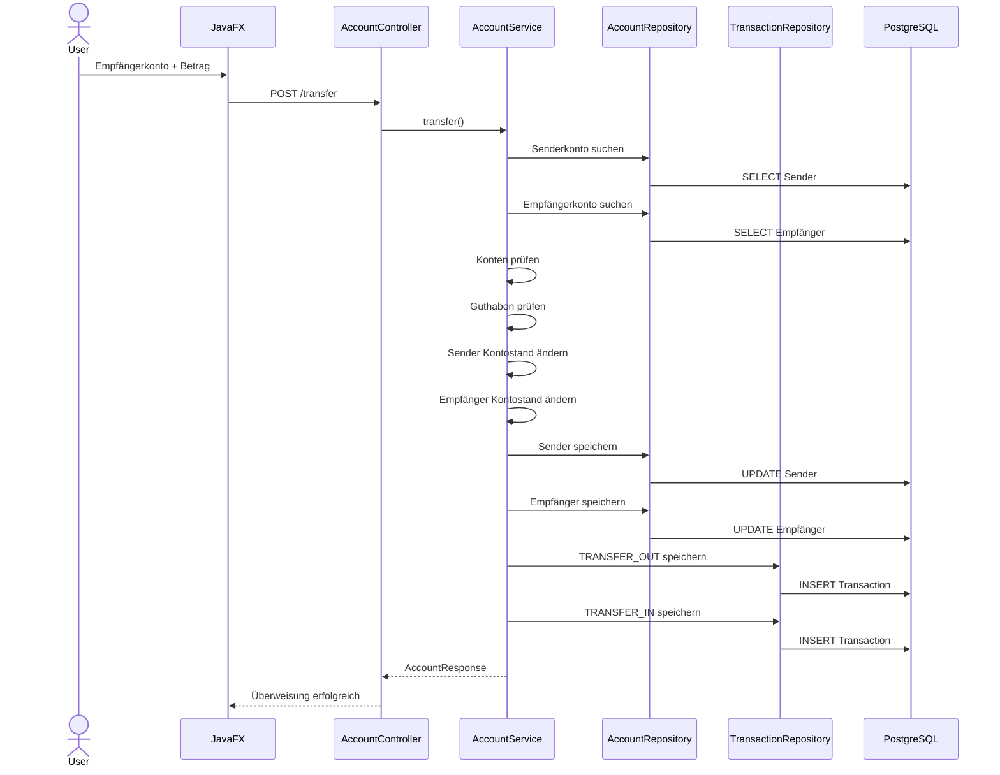
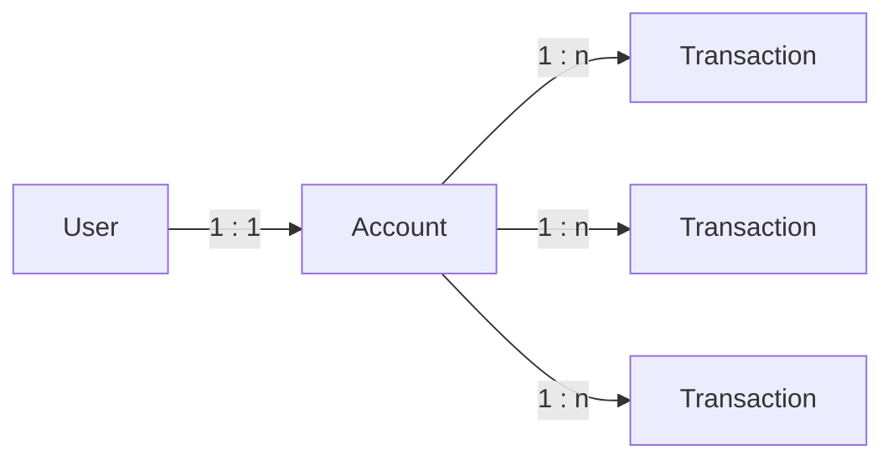

<div align="center">

# 🏦 Banksystem V2

### Fullstack Banking Application

Java • Spring Boot • JavaFX • PostgreSQL

</div>

---

## 📌 Über das Projekt

Banksystem V2 ist eine Java Fullstack Anwendung mit getrenntem Frontend und Backend.

Das System unterstützt:

- Login
- Benutzerverwaltung
- Benutzerrollen
- Bankkonten
- Einzahlungen
- Auszahlungen
- Überweisungen
- Transaktionshistorie

---

# 🛠 Technologien

### Backend

- Java 21
- Spring Boot
- Spring Security
- Spring Data JPA
- Hibernate
- PostgreSQL

### Frontend

- JavaFX
- FXML
- CSS
- Java HTTP Client
- Jackson

### Build

- Maven

---

# 🏗 Systemarchitektur



Das Frontend kommuniziert ausschließlich über HTTP Requests mit dem Spring Boot Backend.

---

# 📦 Backend Architektur



### Controller

Empfängt HTTP Requests und gibt Antworten an das Frontend zurück.

### Service

Enthält die Geschäftslogik des Banksystems.

### Repository

Kommuniziert über Spring Data JPA mit PostgreSQL.

---

# 🧩 Datenmodell



Ein Benutzer besitzt genau ein Konto.

Ein Konto kann mehrere Transaktionen besitzen.

---

# 🔐 Login Ablauf



---

# 👤 Benutzer erstellen



Beim Erstellen eines Benutzers wird automatisch ein Bankkonto erzeugt.

---

# 💰 Einzahlung



---


# 🔁 Überweisung



Die gesamte Überweisung läuft innerhalb einer Datenbanktransaktion.

Dadurch werden alle Änderungen gemeinsam gespeichert oder bei einem Fehler gemeinsam zurückgesetzt.

---

# 📜 Transaktionssystem


Unterstützte Typen:

| Typ | Bedeutung |
|---|---|
| `DEPOSIT` | Einzahlung |
| `WITHDRAWAL` | Auszahlung |
| `TRANSFER_OUT` | Überweisung gesendet |
| `TRANSFER_IN` | Überweisung erhalten |

---

# 🔗 Beziehungen



---

# 🌐 REST API

| Methode | Endpoint | Funktion |
|---|---|---|
| POST | `/api/auth/login` | Login |
| POST | `/api/users` | Benutzer erstellen |
| GET | `/api/users` | Benutzer laden |
| GET | `/api/accounts/user/{userId}` | Konto laden |
| POST | `/api/accounts/user/{userId}/deposit` | Einzahlung |
| POST | `/api/accounts/user/{userId}/withdraw` | Auszahlung |
| POST | `/api/accounts/user/{userId}/transfer` | Überweisung |
| GET | `/api/accounts/user/{userId}/transactions` | Transaktionen laden |

---


# ▶️ Starten

Backend:

```powershell
$env:DB_PASSWORD="DEIN_POSTGRES_PASSWORT"

mvn -pl backend spring-boot:run
```

Frontend in einem zweiten Terminal:

```powershell
mvn -pl frontend javafx:run
```

---

# 🚧 Status

Aktuell umgesetzt:

- ✅ Login
- ✅ Admin Dashboard
- ✅ Benutzer erstellen
- ✅ Bankkonto
- ✅ Einzahlung
- ✅ Auszahlung
- ✅ Überweisung
- ✅ Transaktionshistorie
- ✅ PostgreSQL
- ✅ JavaFX UI
- ✅ CSS Design

---

<div align="center">

**Banksystem V2**

Java Fullstack Lernprojekt

</div>
